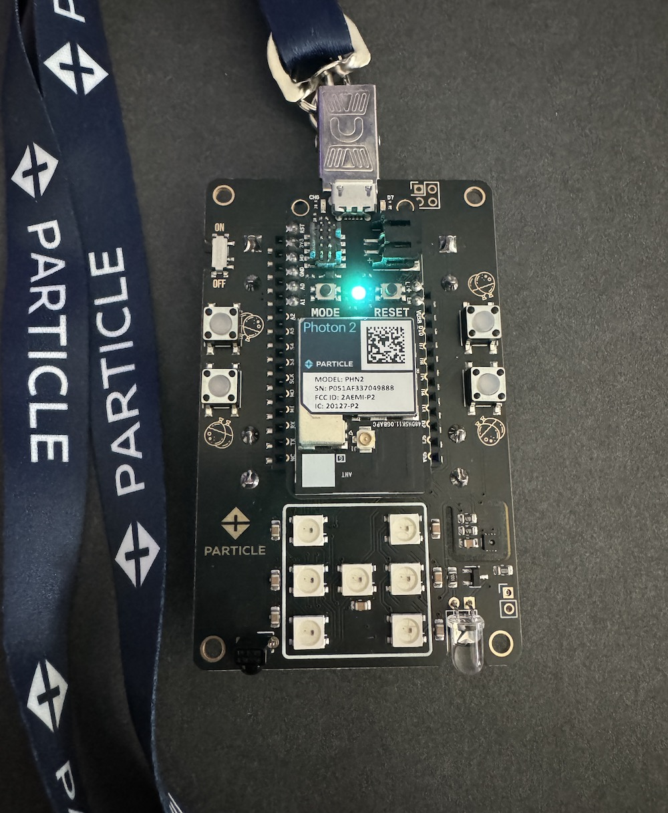
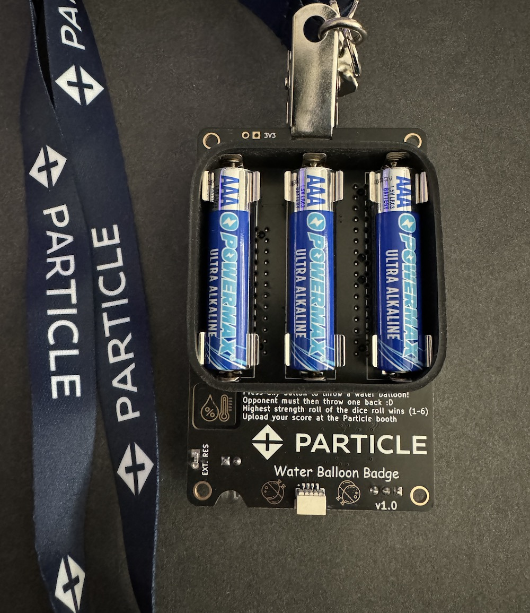
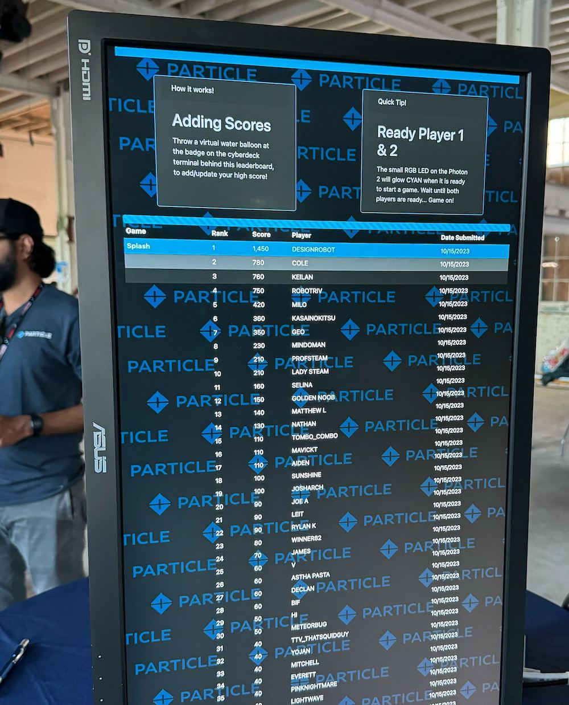

# Particle Bay Area Maker Faire 2023 Water Balloon Badge 

## Our interactive game

If you stopped by the Particle booth for the 2023 Bay Area Maker Faire, spun the prize wheel, and were lucky enough to win our badge, we hope you had a blast playing! 

So, how does it work? Participants turn on their badge(s) and wait for the small LED to glow cyan, letting them know it's ready for a game match to begin. The badge has four buttons, each serving as a launcher for virtual water balloons. Each button triggers attacks with varying strengths, all determined by a virtual die roll. Players take turns launching virtual water balloons, and after an attack and counter-attack, the badges will display the result of the match automatically.  The badge lights up green for a win, red for loss, or blue for a draw.  Players engage with fellow attendees in virtual water balloon battles, roll the dice, aim for high-strength attacks, and secure their win!

Players can only battle the same player up to 10 times (after which badges win glow white to alert you of the limit), so everyone must engage with new players to climb up the leaderboard.

Pro Tip: Point the die side edges of the badges towards each other for the best results (like the video below). The max distance is 10 feet, but the closer you are, the better.

Fun fact: iPhone IR depth mapping is detrimental to gameplay functionality.  So if you are wondering why your badges seem camera shy while videoing, this is why :D

## Gameplay


## Behind the Badge

The Photon 2 based badge isn't just a fun toy. With features like a dual-row socket for Photon 2, an ON/OFF switch, lanyard slots, 7 neopixel RGB LEDs, humidity and temperature sensor, QWIIC/Stemma connector, and a speaker, it's also a toolkit for your post-conference projects. The badge's 38kHz IR demodulator and LEDs also ensure efficient communication for the game.

## Hardware

All the parts are described in Bill of Materials [particle-bamf23-badge.csv](hardware/v1.0/pcb/)

OSHPark is a good place to order with purple or the new "after dark" theme color scheme.  You can upload the KiCad [particle-bamf23-badge.kicad_pcb](hardware/v1.0/pcb/) there directly.  I would download this entire Github repo ZIP file first though instead of just trying to save the PCB file from your browser.

Another way to order PCB's is by using the included [gerbers](hardware/v1.0/gerbers/) and uploading those with all of the necessary specs to companies like [PCBWay](https://www.pcbway.com) or [JLCPCB](https://jlcpcb.com)

The cyberdeck is a Raspberry Pi 400 computer, with Pimoroni Hyperpixel 4.0 Square LCD, along with another water balloon badge for input.  The badge is powered and connected to the pi over USB, and takes input on USB serial /dev/ttyACM0.  Everything was mounted to a laser cut acrylic piece that was bent at a nice angle.  The 40-pin cable was a real pain to make, since every pair of wires was twisted to ensure the proper orientation.  I highly suggest buying one of Adafruit's cyberdeck boards instead.






## Software

```
software/v1.0/badge (badge firmware)
software/v1.0/badge-build (badge build directory)
software/v1.0/badge-interface (badge-interface firmware)
software/v1.0/badge-interface-build (badge-interface build directory)
software/v1.0/leaderboard (cyberdeck software)
```

### Badge

To build the badge firmware, connect a badge over USB and run:

```
cd software/v1.0/badge-build
./build.sh 5.5.0
```

### On-Board SHT31 Temperature/Humidity

To build the SHT31 Temperature/Humidity Demo:

```
change the #define ENABLE_ON_BOARD_SHT31 to (1) at the top of the particle-bamf23-badge.cpp file
cd software/v1.0/badge-build
./build.sh 5.5.0
```


### QWIIC/STEMMA Conenctor Support

To build the QWIIC/STEMMA Conenctor Demo:
I used the VCNL4040 Ambient Light Sensor, but there are tons of sensors to experiment with

```
change the #define ENABLE_QWIIC_SENSOR_DEMO to (1) at the top of the particle-bamf23-badge.cpp file
cd software/v1.0/badge-build
./build.sh 5.5.0
```

### Badge Interface (for Cyberdeck)

To build the badge-interface firmware, connect a badge over USB and run:

```
cd software/v1.0/badge-interface-build
./build.sh 5.5.0
```

### Cyberdeck

To run the cyberdeck software on a Raspberry Pi-400:

```
- copy the cyberdeck folder to your raspberry pi
- ensure node.js is installed ( https://pimylifeup.com/raspberry-pi-nodejs (other seemingly simpler ways didn't work!) )
- ensure electron is installed globally `npm i -g electron`
- in one terminal tab run `electron electron.js`
- in another terminal tab run `node server.js`
- Note: this will likely crash without the leaderboard server running as well, accepting score requests.  I'm leaving that part as an excercise for you.  You can use an express app to accomplish this, with some effort :D  Your leaderboard server should use a local MongoDB so you can restart it from time to time without losing the scores and user nicknames collected.  I ended up implementing separate collections for users and game/score data.
```

# License

Creative Commons Attribution-ShareAlike 4.0 International (CC BY-SA 4.0) - essentially do whatever you want, Full [LICENSE here](LICENSE)
